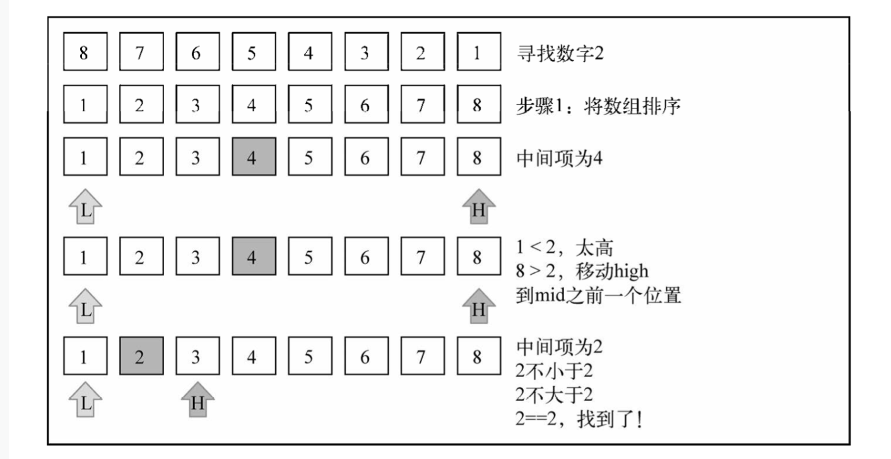

### 基本概念

如果你要查找的数据是有序的，二分查找算法比顺序查找算法更高效。

二分搜索算法的原理和猜数字游戏类似，就是那个有人说"我正想着一个1到100的数字"的游戏。我们每回应一个数字，那个人就会说这个数字是高了、低了还是对了。

### 算法描述

> 这个算法要求被搜索的数据结构已排序

* 选择数组的中间值
* 如果选中值是待搜索值，算法执行完毕（值找到了）
* 如果待搜索值比选中值要小，则返回步骤1并在选中值左边的子数组中寻找
* 如果待搜索值比选中值要大，则返回步骤1并在选种值右边的子数组中寻找

下图展示了二分搜索算法的执行过程：



### 代码实现

```js
Array.prototype.binarySearch = function(value) {
  let row = 0;
  let hight = this.length - 1;
  while (row <= hight) {
    let mid = Math.floor((row + hight) / 2);
    let element = this[mid];
    if (element < value) {
      row = mid + 1;
    } else if (element > value) {
      hight = mid - 1;
    } else {
      return mid;
    }
  }
  return -1;
}

const arr = [3, 44 ,38 , 5, 47, 15, 36, 26, 27, 2, 46, 4, 19, 50, 48];
// 首先进行快速排序
arr = quickSort(arr);
//进行二分查找
arr.binarySearch(19);
```
