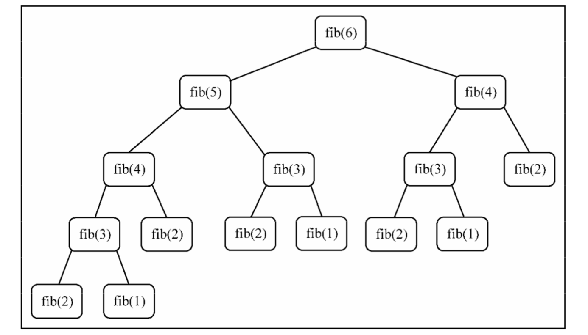

**动态规划**有时被认为是一种与递归相反的技术。

* 递归是从顶部开始将问题分解，通过解决掉所有分解出小问题的方式，来解决整个问题。
* 动态规划解决方案从底部开始解决问题，将所有小问题解决掉，然后合并成一个整体解决方案，从而解决掉整个大问题。

首先，认识一下斐波那契数列：

### 斐波那契数列

定义如下：

* `n < = 2` 时，结果为 `1`
* `n > 2` 时，结果为 `(n - 1)` 的斐波那契数 + `(n - 2)` 的斐波那契数

代码示例：

```js
  function recurFib(n) {
    if (n < 3) return 1;
    return recurFib(n - 1) + recurFib(n - 2);
  }
```

该函数执行效率非常低，如图所示:



很明显有太多值在递归调用中被重新计算。

### 动态规划（Dynamic Programming，DP)

> 动态规划是一种将复杂问题分解成更小的子问题来解决的优化技术。

使用动态规划解决问题时，要遵循三个重要步骤：

* 定义子问题
* 实现要反复执行而解决子问题的部分（可能是递归）
* 识别并求解出边界条件

能用动态规划解决的一些著名的问题如下：

* 背包问题：给出一组项目，各自有值和容量，目标是找出总值最大的项目的集合。这个 问题的限制是，总容量必须小于等于“背包”的容量
* 最长公共子序列：找出一组序列的最长公共子序列（可由另一序列删除元素但不改变余 下元素的顺序而得到）
* 矩阵链相乘：给出一系列矩阵，目标是找到这些矩阵相乘的最高效办法（计算次数尽可能少)，相乘操作不会进行，解决方案是找到这些矩阵各自相乘的顺序
* 硬币找零：给出面额为 d1...dn 的一定数量的硬币和要找零的钱数，找出有多少种找零的方法
* 图的全源最短路径：对所有顶点对(u, v)，找出从顶点u到顶点v的最短路径。

使用动态规划的技巧来设计一个效率更高的斐波那契数列算法：

```js
function dynFib(n) {
  if (n < 3) return 1;

  const arr = [];
  for (let i = 0; i <= n; ++i) {
    if (i < 3) {
      arr[i] = i;
    } else {
      arr[i] = arr[i - 1] + arr[i - 2];
    }
  }
  return arr[n - 1];
}
```

运行结果：

```js
console.time('recurFib');
recurFib(30);
console.timeEnd('recurFib');

console.time('dynFib')
dynFib(30);
console.timeEnd('dynFib');

// recurFib: 9.552ms
// dynFib: 0.086ms
```

结果很明显，动态规划的解决方案要比递归的解决方案更加高效。

如果不使用数组，要使斐波那契函数也能达到同样的效果，进行如下改进：

```js
function iterFib(n) {
  if (n < 3) return 1;

  let last = 1;
  let nextLast = 1;
  let result = 1;
  for (let i = 2; i < n; ++i) {
    result = last + nextLast;
    nextLast = last;
    last = result;
  }
  return result;
}
```
该版本计算斐波那契数列时和动态规划版本效率基本一样。

### 寻找最长公共子串

使用动态规划去查找两个字符串的最长公共子串。比如，`raven` 和 `havoc` 中，最长的公共子串是 `av`。
