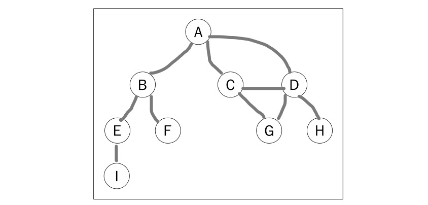
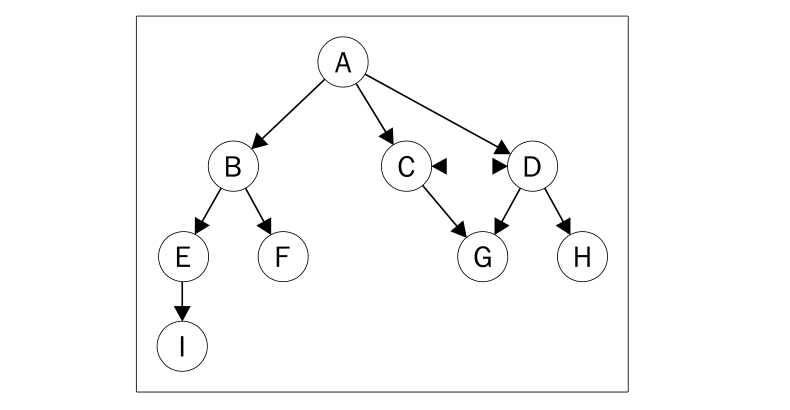
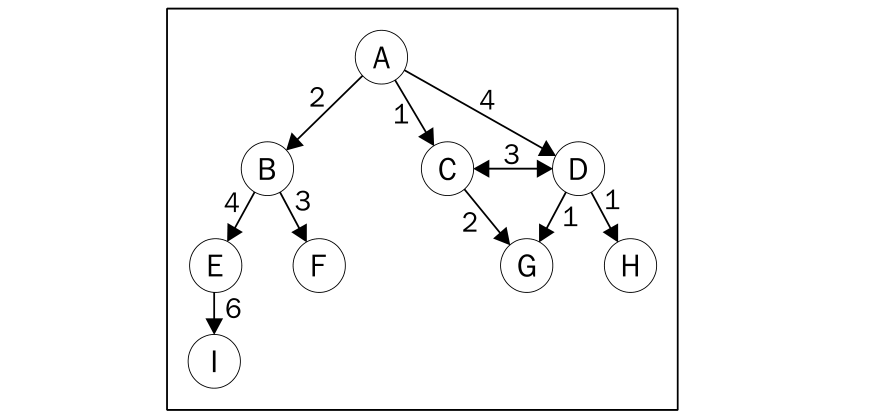
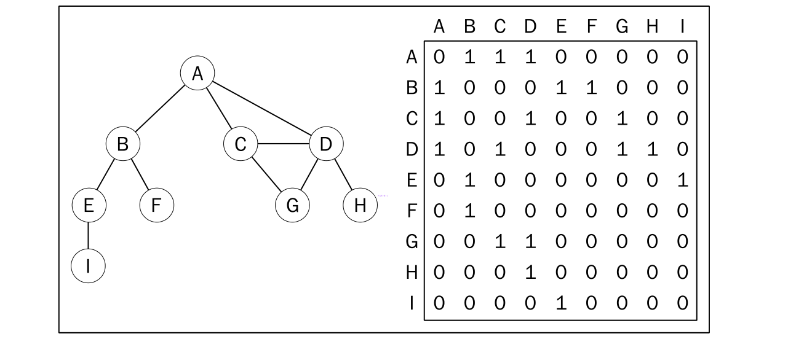
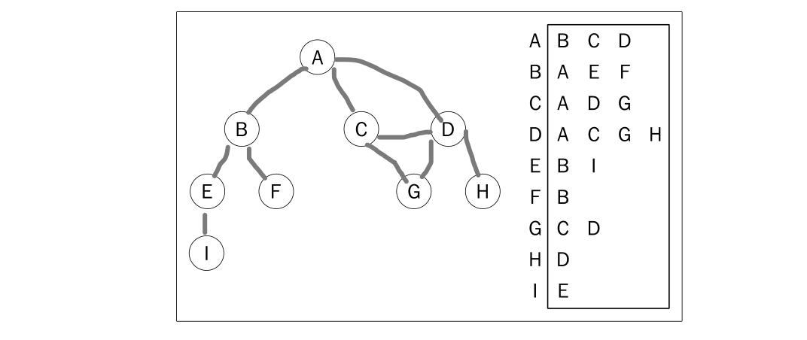
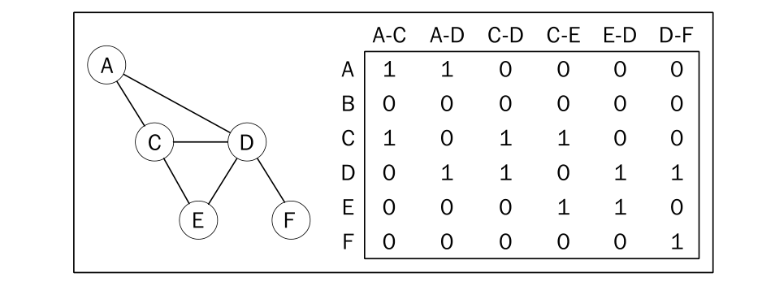

### 基本概念

> 图是网络结构的抽象模型，由由边连接的节点（或顶点）。

一个图 `G=(V, E)` 由以下兀素组成：

* V: 一组顶点
* E: 一组边，连接 `V` 中的顶点

如下表示一个图:



由一条边连接在一起的顶点称为相邻顶点。比如，`A` 和 `B` 是相邻的，`A` 和 `D` 是相邻的，`A` 和 `C` 是相邻的，`A` 和 `E` 不是相邻的。

一个顶点的度是其相邻顶点的数量。比如，`A` 和其他三个顶点相连接，因此，`A` 的度为 `3`; `E`  和其他两个顶点相连，因此，`E` 的度为 `2`。

路径是顶点 `v1, v2, ...vk` 的一个连续序列，其中 `vi` 和 `vi+1` 是相邻的。以上图为例，其中包含路径 `A B E I` 和 `A C D G`。

简单路径要求不包含重复的顶点。举个例子，`ADG` 是一条简单路径。除去最后一个顶点（因 为它和第一个顶点是同一个顶点），环也是一个简单路径，比如 `ADCA`(最后一个顶点重新回到`A`)。

如果图中不存在环，则称该图是无环的。如果图中每两个顶点间都存在路径，则该图是连通的。

### 有向图和无向图

图可以是无向的（边没有方向）或是有向的（有向图）。

如下图所示，有向图的边有一个方向：



如果图中每两个顶点间在双向上都存在路径，则该图是强连通的。例如，`C` 和 `D` 是强连通的，而 `A` 和 `B` 不是强连通的。

图还可以是未加权的（目前为止我们看到的图都是未加权的）或是加权的。如下图所示，加权图的边被赋予了权值：



我们可以使用图来解决计算机科学世界中的很多问题，比如搜索图中的一个特定顶点或搜索 一条特定边，寻找图中的一条路径（从一个顶点到另一个顶点），寻找两个顶点之间的最短路径， 以及环检测。

从数据结构的角度来说，我们有多种方式来表示图。在所有的表示法中，不存在绝对正确的 方式。图的正确表示法取决于待解决的问题和图的类型。

### 邻接矩阵

图最常见的实现是邻接矩阵。每个节点都和一个整数相关联，该整数将作为数组的索引。

我们用一个二维数组来表示顶点之间的连接。如果索引为 `i` 的节点和索引为 `j` 的节点相邻，则 `array[i][j] ===1`，否则 `array[i][j] === 0`,如下图所示：



不是强连通的图（稀疏图）如果用邻接矩阵来表示，则矩阵中将会有很多 `0`,这意味着我们 浪费了计算机存储空间来表示根本不存在的边。

例如，找给定顶点的相邻顶点，即使该顶点只有一个相邻顶点，我们也不得不迭代一整行。

邻接矩阵表示法不够好的另一个理由是，图中顶点的数量可能会改变，而二维数组不太灵活。


### 邻接表

> 邻接表由图中每个顶点的相邻顶 点列表所组成。

我们可以用列表（数组）、链表，甚至是散列表或者字典来表示相邻顶点列表。

下面的示意图展示了邻接表数据结构：



尽管邻接表可能对大多数问题来说都是更好的选择，但以上两种表示法都很有用，且它们有 着不同的性质（例如，要找出顶点V和W是否相邻，使用邻接矩阵会比较快)。

在接下来的示例中， 我们将会使用邻接表表示法。

### 关联矩阵

> 我们还可以用关联矩阵来表示图，在关联矩阵中，矩阵的行表示顶点，列表示边。

如下图所示，我们使用二维数组来表示两者之间的连通性，如果顶点 `v` 是边 `e` 的入射点，则 `array[v][e] === 1`; 否则，`array [v][e] === 0`。



关联矩阵通常用于边的数量比顶点多的情况下，以节省空间和内存。

创建图类：

```js
const Dictionary = require('./dictionary.js');

class Graph {
  constructor() {
    this.vertices = [];
    this.adjList = new Dictionary();
  }

  // 添加顶点
  addVertex(v) {
    this.vertices.push(v);
    this.adjList.add(v, []);
  }

  // 添加边
  addEdge(v, w) {
    this.adjList.find(v).push(w);
    this.adjList.find(w).push(v);
  }

  toString() {
    this.vertices.forEach(v => {
      let str = `${v} => `;
      this.adjList.find(v).forEach(w => {
        str +=  ' ' + w
      });
      console.log(str);
    })
  }
}
```

使用图类：

```js
const graph = new Graph();

['A', 'B', 'C', 'D', 'E', 'F', 'G', 'H', 'I'].forEach(c => graph.addVertex(c));

graph.addEdge('A', 'B');
graph.addEdge('A', 'C');
graph.addEdge('A', 'D');
graph.addEdge('C', 'D');
graph.addEdge('C', 'G');
graph.addEdge('D', 'G');
graph.addEdge('D', 'H');
graph.addEdge('B', 'E');
graph.addEdge('B', 'F');
graph.addEdge('E', 'I');

graph.toString();

// 输出
/*
A =>  B C D
B =>  A E F
C =>  A D G
D =>  A C G H
E =>  B I
F =>  B
G =>  C D
H =>  D
I =>  E
*／
```

### 图的遍历


