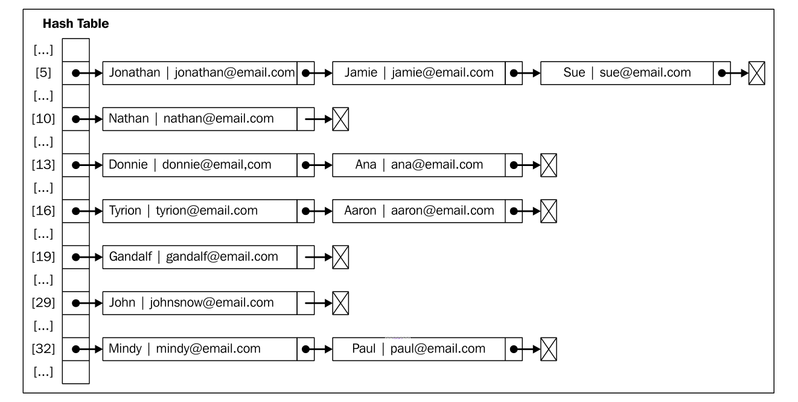

### 基本概念

> 散列是一种常用的数据存储技术，散列后的数据可以快速地插入或取用。散列使用的数据结构叫做散列表。

散列算法的作用是尽可能快地在数据结构中找到一个值。在字典章节的例子中，如果要在数据结构中获得一个值（使用 `find` 方法），需要遍历整个数据结构来得到它。如果使用散列函数，就知道值的具体位置，因此能够快速检索到该值，散列函数的作用是给定一个键值，然后返回值在表中的地址。

举个例子，我们继续使用上面字典中的代码示例。我们将要使用最常见的散列函数 - 'lose lose'散列函数，方法是简单地将每个键值中的每个字母的ASCII值相加。如下图：


### 实现一个简单的散列表：

```js


class HashTable {

  constructor() {
    this.table = [];
  }

  static LoseLoseHashCode(key) {
    let hash = 0;
    console.log(key);
    for (let code of key) {
      hash += code.charCodeAt();
    }

    return hash % 37;
  }

  // 新增 or 修改
  append(key, value) {
    const position = HashTable.LoseLoseHashCode(key);
    this.table[position] = value;
    console.log(`${position} -- ${value}`);
    return true;
  }

  get(key) {
    const position = HashTable.LoseLoseHashCode(key);
    return this.table[position];
  }

  remove(key) {
    const position = HashTable.LoseLoseHashCode(key);
    this.table[position] = undefined;
  }
}
```

### Demo

```js
const hashTable = new HashTable();
hashTable.append('Gandalf', 'gandalf@email.com');
hashTable.append('John', 'johnsnow@email.com');
hashTable.append('Tyrion', 'tyrion@email.com');
console.log(hashTable.get('Gandalf')); // gandalf@email.com
console.log(hashTable.get('Loiane')); // undefined
hashTable.remove('Surmon');
console.log(hashTable.show());
// 16 : tyrion@email.com
// 19 : gandalf@email.com
// 29 : johnsnow@email.com
```

由于元素分布于整个数组范围内，一些位置会没有任何元素占据，并默认为 `undefined` 值。因此，对于 `HashTable` 类来说，我们不需要像 `ArrayList` 类一样从 `table` 数组中移除元素。只需要将其设置为 `undefined` 即可。

下图展现了包含这三个元素的 `HashTable` 数据结构:


### 处理散列表中的冲突

有时候，一些键会有相同的散列值。不同的值在散列表中对应相同位置的时候，我们称其为冲突。如下代码：

```js
const hash = new HashTable()
hash.append('Gandalf',    'gandalf@email.com')
hash.append('John', 'johnsnow@email.com')
hash.append('Tyrion', 'tyrion@email.com')
hash.append('Aaron',    'aaron@email.com')
hash.append('Donnie', 'donnie@email.com')
hash.append('Ana', 'ana@email.com')
hash.append('Jonathan', 'jonathan@email.com')
hash.append('Jamie', 'jamie@email.com')
hash.append('Sue',    'sue@email.com')
hash.append('Mindy', 'mindy@email.com')
hash.append('Paul', 'paul@email.com')
hash.append('Nathan', 'nathan@email.com')

// 5 : jonathan@email.com
// 5 : jamie@email.com
// 5 : sue@email.com
// 10 : nathan@email.com
// 13 : donnie@email.com
// 13 : ana@email.com
// 16 : tyrion@email.com
// 16 : aaron@email.com
// 19 : gandalf@email.com
// 29 : johnsnow@email.com
// 32 : mindy@email.com
// 32 : paul@email.com
```
在上面代码中：

* Tyrion 、Aaron 有相同的散列值 `16`
* Donnie 、Ana 有相同的散列值 `13`
* Jonathan、Jamie、Sue 有相同的散列值 `5`
* Mindy、Paul 有相同的散列值 `32`

导致最终的数据对象中，只有最后一次被添加/修改的数据会覆盖原本数据。

使用数据结构保存数据的目的显然不能丢失这些数据，而要通过某种方法将它们全部保存起来；因此，当这种情况发生的时候就要去解决它。

处理冲突有几种方法：

* 开链法
* 线性探测法
* 双散列法

下面介绍前两种方法。

##### 开链法

开链法法包括为散列表的每一个位置创建一个链表并将元素存储在里面。它是解决冲突的最简单的方法，但是它在 `HashTable` 实例之外还需要额外的存储空间。

例如，我们在之前的测试代码中使用分离链接的话，输出结果将会是这样：



* 在位置5上，将会有包含三个元素的LinkedList实例
* 在位置13、16和32上，将会有包含两个元素的LinkedList实例
* 在位置10、19和29上，将会有包含单个元素的LinkedList实例

对于分离链接和线性探查来说，只需要重写三个方法：`append`、`get` 和 `remove` 这三个方法，在 每种技术实现中都是不同的。

为了实现一个使用了分离链接的 `HashTable` 实例，我们需要一个新的辅助类来表示将要加人 `LinkedList` 实例的元素，在这里我们可以直接使用链表类。

下面我们加入链表类重写三个方法：

```js
append(key, value) {
    const position = HashTable.LoseLoseHashCode(key);
    if (this.table[position] === void 0) {
      this.table[position] = new LinkedList();
    }
    this.table[position].append({key, value});
  }

  get(key) {
    const position = HashTable.LoseLoseHashCode(key);
    if (this.table[position] !== void 0) {
      const getElementValue = node => {
        if (!node && !node.element) return undefined;
        if (Object.is(node.element.key, key)) {
          return node.element.value;
        } else {
          return getElementValue(node.next);
        }
      }
      return getElementValue(this.table[position].head);
    }
    return undefined;
  }

  remove(key) {
    const position = HashTable.LoseLoseHashCode(key);
    if (this.table[position] !== undefined) {
      const getElementValue = node => {
        if (!node && !node.element) return false;
        if (Object.is(node.element.key, key)) {
          this.table[position].remove(node.element);
          if (this.table[position].isEmpty()) {
            this.table[position] = undefined;
          }
          return true;
        } else {
          getElementValue(node.next);
        }
      }
      return getElementValue(this.table[position].head);
    }
    return false;
  }
```

##### 线性探测法

> 线性探测法隶属于一种更一般化的散列技术: 开放寻址散列。

向表中某个位置加人一个新元素的时候，如果索引为 `index` 的位置为空，则将数据存入该位置，否则就尝试 `index++` 的位置，直到找到一个空的位置为止。如下图：


下面我们通过线性探测法重写三个方法：

```js
  /*
   * 线性探测法
  */
  append(key, value) {
    const position = HashTable.LoseLoseHashCode(key);
    if (this.table[position] === void 0) {
      this.table[position] = {key, value};
    } else {
      let index = ++position;
      while(this.table[index] !== void 0) {
        index++;
      }
      this.table[indx] = {key, value};
    }
  }

  get(key) {
    const position = HashTable.LoseLoseHashCode(key);
    if (this.table[position] !== void 0) {
      if (Object.is(this.table[index].key, key)) {
        return this.table[position].value;
      } else {
        const index = ++position;
        while (this.table[index] === void 0 || Object.is(this.table[index].key, key)) {
          index++;
        }
        return Object.is(this.table[index].key, key) ? this.table[index].value : undefined;
      }
    }
    return undefined;
  }

  remove(key) {
    const position = HashTable.LoseLoseHashCode(key);
    if (this.table[position] !== void 0) {
      if (Object.is(this.table[index].key, key)) {
        this.table[position] = void 0;
        return true;
      } else {
        const index = ++position;
        while (this.table[index] === void 0 || Object.is(this.table[index].key, key)) {
          index++;
        }
        if (Object.is(this.table[index].key, key)) {
          this.table[index] = void 0;
          return true;
        } else {
          return false;
        }
      }
    }
    return false;
  }
```

### 创建更好的散列函数

我们实现的"lose lose"散列函数并不是一个表现良好的散列函数，因为它会产生太多的冲 突。如果我们使用这个函数的话，会产生各种各样的冲突。一个表现良好的散列函数是由几个方 面构成的：插人和检索元素的时间（即性能），当然也包括较低的冲突可能性。我们可以在网上 找到一些不同的实现方法。像：`djb2`、`sdbm` ...，或者也可以实现自己的散列函数。

其中一个可以实现的比“lose lose”更好的散列函数是 djb2：

```js
static djb2HashCode(key) {
  let hash = 5381;
  for(let codePoint of key) {
    hash = hash * 33 + codePoint.charCodeAt();
  }
  return hash % 1013;
}
```

使用 `djb2HashCode` 代替 `LoseLoseHashCode` 函数运行上面的程序，结果无冲突。

虽然，这并不是最好的散列函数，但这是最被社区推荐的散列函数之一。

