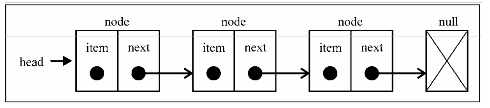
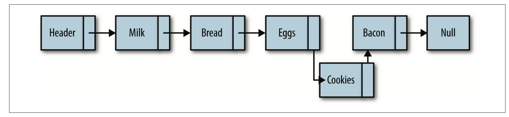
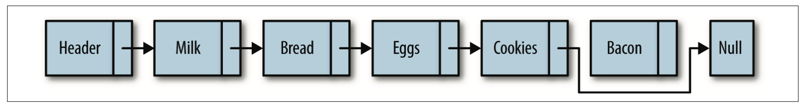
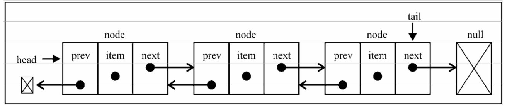
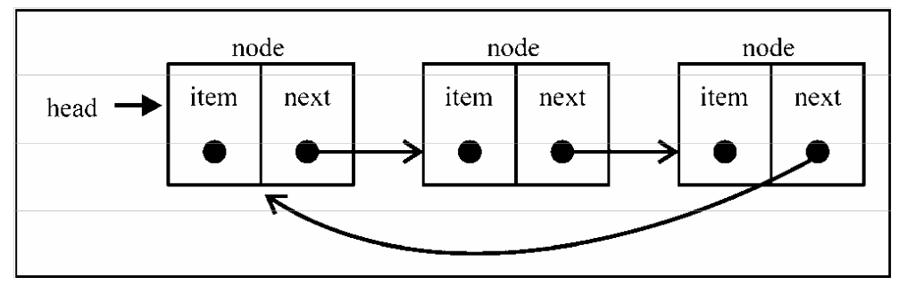

### 基本概念

> 链表是由一组节点组成的集合。每个节点都使用一个对象的引用指向它的后继。指向另一 个节点的引用叫做链。

要存储多个元素，数组（或列表）可能是最常用的数据结构。然而，这种数据结构有一个缺点：在大多数语言中，数组的大小是固定的，从数组的起点或中间插入或移除项的成本很高，因为需要移动元素；尽管 JavaScript 中的 `Array` 类方法可以帮我们做这些事，但背后的处理机制同样如此。

链表存储有序的元素集合，但不同于数组，链表中的元素在内存中并不是连续放置的。每个元素由一个存储元素本身的节点和一个指向下一个元素的引用(也称指针或链接)组成。下图展示了链表的结构:



链表中插入一个节点的效率很高。向链表中插入一个节点，需要修改它前面的节点(前 驱)，使其指向新加入的节点，而新加入的节点则指向原来前驱指向的节点。下图演示了如何在 `eggs` 后加入 `cookies`。



从链表中删除一个元素也很简单。将待删除元素的前驱节点指向待删除元素的后继节点，同时
将待删除元素指向 `null`，元素就删除成功了。下图演示了从链表中删除 `bacon` 的过程。




##### Node 类

> Node 类包含两个属性: `element` 用来保存节点上的数据，`next` 用来保存指向下一个节点的
链接。

```js
  // 链表节点
  class Node {
    contructor(element) {
      this.element = element;
      this.next = null;
    }
  }
```

##### LinkedList 类

> 该类提供了对链表进行操作的方法，例如：插入、删除、查找

```js
// 链表节点
class Node {
  constructor(element) {
    this.element = element;
    this.next = null;
  }
}

// 链表
class LinkedList {
  constructor() {
    this.head = null;
    this.length = 0;
  }

  // 追加元素
  append(element) {
    const node = new Node(element);
    let current = null;
    if (this.head === null) {
      this.head = node;
    } else {
      current = this.head;
      while (current.next) {
        current = current.next;
      }
      current.next = node;
    }
    this.length ++;
  }

  // 任意位置添加元素
  insert(element, position) {
    if (position >= 0 && position <= this.length) {
      const node = new Node(element);
      let current = this.head;
      let previous = null;
      let index = 0;
      if (position === 0) {
        // 判断head是否为空，
        if (!this.head) {
          this.head = node;
        } else {
          node.next = current;
          this.head = node;
        }
      } else {
        while (index ++ < position) {
          previous = current;
          current = current.next;
        }
        node.next = current;
        previous.next = node;
      }

      this.length ++;
      return true;
    }
    return false;
  }

  // 查找元素下标
  findIndex(element) {
    let current = this.head;
    let index = -1;
    while (current) {
      if (element === current.element) {
        return index + 1;
      }
      current = current.next;
      index++;
    }

    return -1;
  }

  // 移除元素
  removeAt(position) {
    if (position > -1 && position <= this.length) {
      let current = this.head;
      let index = 0;
      let previous = null;
      if (position === 0) {
        this.head = current.next;
      } else {
        while (index++ < position) {
          previous = current;
          current = current.next;
        }
        previous.next = current.next;
      }

      this.length--;
      return true;
    }
    return false;
  }

  // 移除指定元素
  remove(element) {
    const index = this.findIndex(element);
    return this.removeAt(index);
  }

  // 是否空链表
  isEmpty() {
    return !this.length;
  }

  // 链表长度
  size() {
    return this.length;
  }

  // 显示元素
  show() {
    let current = this.head;
    let str = '';
    while (current) {
      str += `${current.element} `;
      current = current.next;
    }
    return str;
  }
}
```

##### Deno

```js
const linkedList = new LinkedList();

console.log(linkedList.isEmpty()); // true
linkedList.append('zhu');
linkedList.append('meng');
linkedList.append('han');
linkedList.insert('han00', 1);
console.log(linkedList.size()); // 4
console.log(linkedList.show()); // zhu han00 meng han
console.log(linkedList.findIndex('meng')); // 2
console.log(linkedList.removeAt(2)); // true
console.log(linkedList.show()); // zhu han00 han
```

##### 双向链表

链表有多种不同的类型，这一节介绍双向链表。双向链表和普通链表的区别在于，在链表中， 一个节点只有链向下一个节点的链接，而在双向链表中，链接是双向的：一个链向下一个元素，另一个链向前一个元素，如下图所示:

双向链表提供了两种迭代列表的方法：从头到尾，或者反过来。我们也可以访问一个特定节点的下一个或前一个元素。



实现双向链表

```js
  // 链表节点
  class Node {
    constructor(element) {
      this.element = element;
      this.prev = null;
      this.next = null;
    }
  }

  // 双向链表
  class DoublyLinkedList {
    constructor() {
      this.head = null;
      this.end = null;
      this.length = 0;
    }

    // 任意位置添加元素
    insert(element, position) {
      if (position >= 0 && position <= this.length) {
        const node = new Node(element);
        let current = this.head;
        let index = 0;
        let previous = null;
        // 第一个位置
        if (position === 0) {
          if(!this.head) {
            this.head = node;
            this.end = node;
          } else {
            node.next = current;
            current.prev = node;
            this.head = node;
          }
        } else if (position === this.length) { // 在尾部添加
          while (index++ < position) {
            previous = current;
            current = current.next;
          }
          node.next = current;
          previous.next = node;
          node.prev = previous;
        } else {
          while (index ++ < position) {
            previous = current;
            current = current.next;
          }
          node.next = current;
          previous.next = node;

          current.prev = node;
          node.prev = previous;
        }
        this.length ++;
        return true;
      }
      return false;
    }

    // 移除指定位置元素
    removeAt(position) {
      if (position > -1 && position <= this.length) {
        let current = this.head;
        let previous = null;
        let index = 0;

        // 移除第一个
        if (position === 0) {
          this.head = this.head.next;
          this.head.prev = null;
          if (this.length === 1) {
            this.end = null;
          }
        } else if (position === this.length) { // 移除最后一个
          while (index++ < position -1) { // 拿到最后一个元素
            previous = current;
            current = current.next;
          }
          previous.next = current.next;
          current.prev.prev = previous;
        } else {
          while (index++ < position) {
            previous = current;
            current = current.next;
          }
          previous.next = current.next;
          current.prev.prev = previous;
        }

      }
      return false;
    }
    // 其他方法...
  }
```

##### Demo

```js
const doubleLinkedList = new DoublyLinkedList();

doubleLinkedList.append('zhu');
doubleLinkedList.append('meng');
doubleLinkedList.append('han');
console.log(doubleLinkedList.show()); // zhu meng han
doubleLinkedList.insert('han00', 1);
doubleLinkedList.insert('han00', 0);
doubleLinkedList.insert('han00', 5);
console.log(doubleLinkedList.show()); // han00 zhu han00 meng han han00
doubleLinkedList.removeAt(6);
console.log(doubleLinkedList.show()); // han00 zhu han00 meng han
doubleLinkedList.removeAt(1);
console.log(doubleLinkedList.show()); // han00 han00 meng han
```

##### 循环链表

循环链表和单向链表相似，节点类型都是一样的。循环链表和链表之间唯一的区别在于，最后一个元素指向下一个元素的指针(`end.next`)不是引用`null`， 而是指向第一个元素(`head`)，如下图所示。



链表相比数组最重要的优点，那就是无需移动链表中的元素，就能轻松地添加和移除元素。

因此，当你需要添加和移除很多元素 时，最好的选择就是链表，而非数组。
