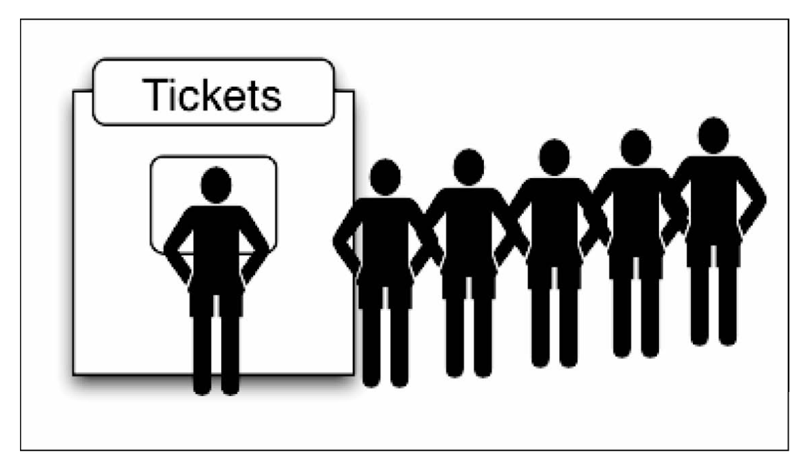

### 基本概念

> 队列(queue),与栈(stack)类似，也是一种线性结构，操作与栈类似，但与栈不同的是，队列使用的是先进先出( `First-In-First-Out，FIFO` )的操作方式。

在现实中，最常见的例子就是排队，吃饭排队、银行业务排队、公车的前门上后门下机制...，前面的人优先完成自己的事务，完成之后，下一个人才能继续。



### 定义队列

```js
class Queue {

  constructor(data) {
    this.dataStore = data || [];
  }

  // 检测队列是否为空
  isEmpty() {
    return !!this.dataStore.length;
  }

  // 队尾加入元素
  enqueue(element) {
    this.dataStore.push(element);
  }

  // 删除队首元素
  dequeue() {
    this.dataStore.shift();
  }

  // 队首元素
  front() {
    return this.dataStore[0];
  }

  // 队尾元素
  back() {
    return this.dataStore[this.size() - 1];
  }

  // 队列长度
  size() {
    return this.dataStore.length;
  }

  // 清除队列
  clear() {
    this.dataStore = [];
  }

  // 打印队列
  show() {
    console.log(this.dataStore.toString());
  }
}
```

##### Demo

```js
const queue = new Queue();

console.log('isEmpty: ' + queue.isEmpty()); // isEmpty: false
queue.enqueue('zhu');
queue.enqueue('meng');
queue.enqueue('han');
queue.show(); // zhu,meng,han
console.log('size: ' + queue.size()); // size: 3
console.log('front: ' + queue.front()); // front: zhu
console.log('back: ' + queue.back()); // back: han
queue.dequeue();
queue.show(); // meng,han
queue.clear();
queue.show(); //
```

### 队列排序

> 队列不仅用于执行现实生活中与排队有关的操作，还可以用于对数据进行排序。

##### 优先队列

在一般情况下，从队列中删除的元素，一定是率先入队的元素。但是也有一些使用队列的 应用，在删除元素时不必遵守先进先出的约定。这种应用，需要使用一个叫做优先队列的 数据结构来进行模拟。

从优先队列中删除元素时，需要考虑优先权的限制。比如医院急诊科(Emergency Department)的候诊室，就是一个采取优先队列的例子。当病人进入候诊室时，分诊护士会评估患者病情的严重程度，然后给一个优先级代码。高优先级的患者先于低优先级的患 者就医，同样优先级的患者按照先来先服务的顺序就医。

实现一个优先队列，有两种选项：

* 设置优先级，然后在正确的位置添加元素；
* 用入列操作添加元素，然后按照优先级移除它们。

在下面示例中，我们将会在正确的位置添加元素，因此可以对它们使用默认的出列操作：

重写 enqueue() 方法:

```
  // 根据优先级添加元素
  enqueue(element, priority) {
    const queueElement = {element, priority};

    if (this.isEmpty()) {
      this.dataStore.push(queueElement);
    } else {
      const preIndex = this.dataStore.findIndex(item => item.priority > queueElement.priority);
      if (preIndex > -1) {
        this.dataStore.splice(preIndex, 0, queueElement);
      } else {
        this.dataStore.push(queueElement);
      }
    }
  }

  // 打印队列
  show() {
    const str = this.dataStore.map(item => item.element).toString();
    console.log(str);
  }
```

重写 dequeue() 方法：

```js
  // 队尾加入元素
  enqueue(element, priority) {
    this.dataStore.push({element, priority});
  }

  // 优先删除优先级最高的元素
  dequeue() {
    let minIndex = 0;
    for (let i = 0, len = this.size(); i < len; ++i) {
      if (this.dataStore[i].priority < this.dataStore[minIndex].priority) {
        minIndex = i;
      }
    }
    return this.dataStore.splice(minIndex, 1);
  }

  // 打印队列
  show() {
    const str = this.dataStore.map(item => item.element).toString();
    console.log(str);
  }
```

##### 循环队列

为充分利用向量空间，克服"假溢出"现象的方法是：将向量空间想象为一个首尾相接的圆环，并称这种向量为循环向量。存储在其中的队列称为循环队列（`Circular Queue`）。这种循环队列可以以单链表、队列的方式来在实际编程应用中来实现。

下面我们基于首次实现的队列类，简单实现一个循环引用的示例：

```js
class LoopQueue extends Queue {

  constructor(data) {
    super(data);
  }

  getIndex(index) {
    const length = this.size();
    return index > length ? (index % length) : index;
  }

  find(index) {
    return !this.isEmpty() ? this.dataStore[this.getIndex(index) - 1] : null;
  }
}
```

##### Demo

```js
const loopQueue = new LoopQueue(['zhu']);
loopQueue.enqueue('meng');
loopQueue.enqueue('han');
loopQueue.enqueue('zhu1');
loopQueue.enqueue('meng1');
loopQueue.enqueue('han1');

console.log(loopQueue.find(123)); // han
```


