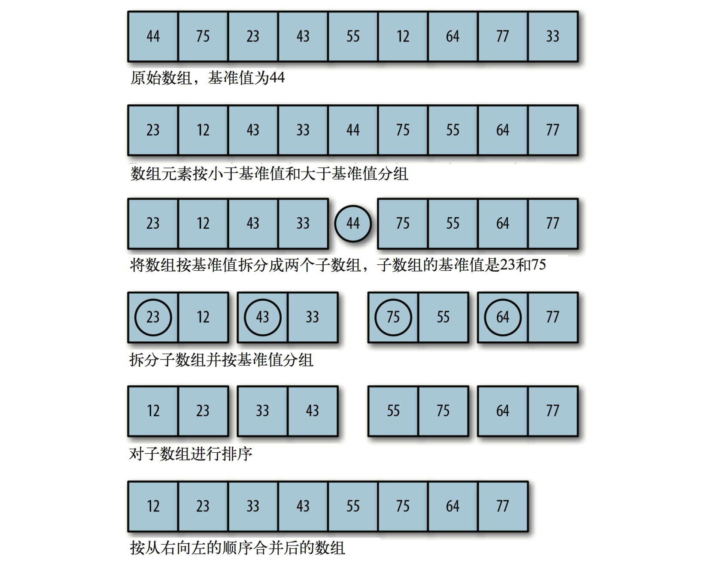

### 基本概念

快速排序是处理大数据集最快的排序算法之一。它的复杂度为 `O(nlog^n)`，且它的性能通常比其他的复杂度为 `O(nlog^n)`的排序算法要好。和归并排序一样，快速排序也使用分治的方法，将原始数组分为较小的数组（但它没有像归并排序那样将它们分割开)。

> 快速排序的最坏运行情况是 `O(n²)`，比如说顺序数列的快排。但它的平摊期望时间是 `O(nlog^n)`，且 `O(nlog^n)` 记号中隐含的常数因子很小，比复杂度稳定等于 `O(nlog^n)` 的归并排序要小很多。所以，对绝大多数顺序性较弱的随机数列而言，快速排序总是优于归并排序。

### 算法步骤

* 从数列中挑出一个元素，称为 “基准”（pivot）;
* 重新排序数列，所有元素比基准值小的摆放在基准前面，所有元素比基准值大的摆在基准的后面（相同的数可以到任一边）。在这个分区退出之后，该基准就处于数列的中间位置。这个称为分区（partition）操作；
* 递归地（recursive）把小于基准值元素的子数列和大于基准值元素的子数列排序；

下图演示了数据围绕基准值进行排序的过程：



### 动图演示


### 代码实现

```js
function quickSort(arr) {
  const len = arr.length;

  if (len < 2) {
    return arr;
  }

  let left = [],
      right = [],
      pivot = arr[0];

  for (let i = 1; i < len; ++i) {
    if (arr[i] < pivot) {
      left.push(arr[i]);
    } else {
      right.push(arr[i]);
    }
  }

  return quickSort(left).concat(pivot, quickSort(right));
}

const arr = [3, 44 ,38 , 5, 47, 15, 36, 26, 27, 2, 46, 4, 19, 50, 48];

console.log(quickSort(arr));
```
