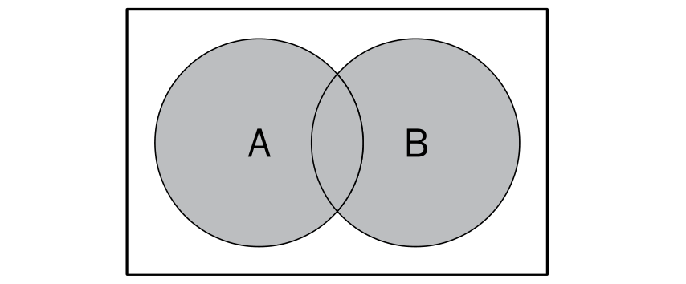
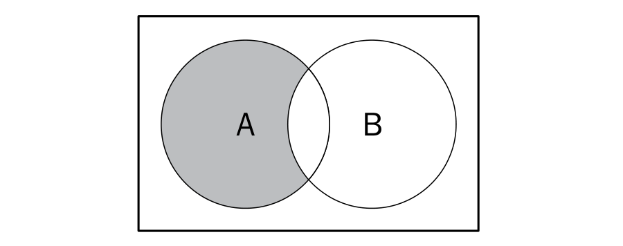
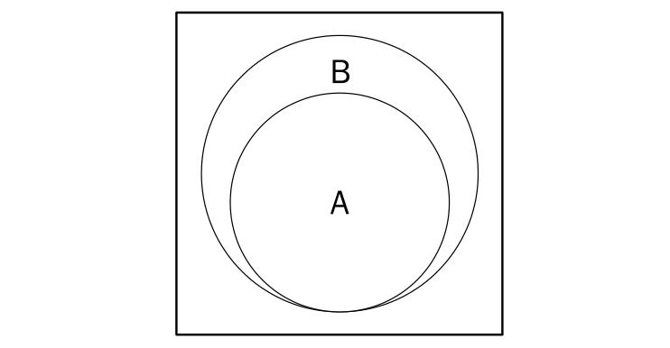

### 基本概念

> 集合是由一组无序且唯一但彼此之间又有一定相关性的成员构成的。

比如说：一个由大于或等于0的证书组成的自然数集合：`N = { 0, 1, 2, 3, 4, 5, 6, ... }`，集合中的对象列表用 `{}` 包围。

目前 ES6 中已内置了 `Set` 类型的实现。

实现一个 `Set` 构造函数：

```js
class Set {

  constructor() {
    this.dataStore = {};
  }

  // 判断是否已存在
  has(value) {
    return this.dataStore.hasOwnProperty(value);
  }

  // 添加
  append(value) {
    if (!this.has(value)) {
      this.dataStore[value] = value;
    }
  }

  // 移除
  remove(value) {
    if (this.has(value)) {
      delete this.dataStore[value];
      return true;
    }
    return false;
  }

  // 清空
  clear() {
    this.dataStore = {};
  }

  // 长度
  get size() {
    return Object.keys(this.dataStore).length;
  }

  get values() {
    return Object.values(this.dataStore);
  }
}
```

### Demo

```js
const set = new Set();

set.append('zhu');
console.log(set.has('zhu')); // true
set.append('meng');
set.append('han');
console.log(set.size); // 3
console.log(set.values); // ['zhu', 'meng', 'han']
set.remove('meng');
console.log(set.values); // ['zhu', 'han']
set.clear();
console.log(set.dataStore); // {}
```

### 对集合可以进行如下操作：

* **并集：**对于给定的两个集合，返回一个包含两个集合中所有元素的新集合。‰
* **交集：**对于给定的两个集合，返回一个包含两个集合中Р有元素的新集合。‰
* **差集：**对于给定的两个集合，返回一个包含所有存在于第一个集合且不存在于第二个集合的元素的新集合。‰
* **子集：**求证一个给定集合是否是另一集合的子集。


#### 并集

> 并集的数学概念：集合 `A` 和 `B` 的并集，表示为 `A∪B`，定义如下：`A∪B = { x | x∈A ∨ x∈B }`，意思是 `x`（元素）存在于 `A` 中，或 `x` 存在于 `B` 中。如图：



基于刚才的 `Set` 类实现一个并集方法：

```js
  union(otherSet) {
    let temp = new Set();
    this.values.forEach(item => {
      temp.append(item);
    });
    otherSet.values.forEach(item => {
      temp.append(item);
    });
    return temp;
  }
```

#### 交集

> 交集的数学概念：集合 `A` 和 `B` 的交集，表示为 `A∩B`，定义如下：`A∩B = { x | x∈A ∧ x∈B }`，意思是 `x`（元素）存在于 `A` 中，且 `x` 存在于 `B` 中。如图：


基于刚才的 `Set` 类实现一个交集方法：

```js
  intersection(otherSet) {
    let temp = new Set();
    this.values.forEach(item => {
      if(otherSet.has(item)) {
        temp.append(item);
      }
    });
    return temp;
  }
```

#### 差集

> 差集的数学概念：集合 `A` 和 `B` 的差集，表示为 `A-B`，定义如下：`A-B = { x | x∈A ∧ x∉B }，意思是 `x`（元素）存在于 `A` 中，且不 `x` 存在于 `B` 中。如图：



基于刚才的 `Set` 类实现一个差集方法：

```js
  difference(otherSet) {
    let temp = new Set();
    this.values.forEach(item => {
      if(!otherSet.has(item)) {
        temp.append(item);
      }
    });
    return temp;
  }
```

#### 子集

> 子集的数学概念：集合 `A` 是 `B` 的子集，或者说集合 `B` 包含了集合 `A`，如图：



基于刚才的 `Set` 类实现一个子集方法：

```js
  subset(otherSet) {
    if (this.size > otherSet.size) {
      return false;
    } else {
      return !this.values.some(value => !otherSet.has(value));
    }
  }
```
