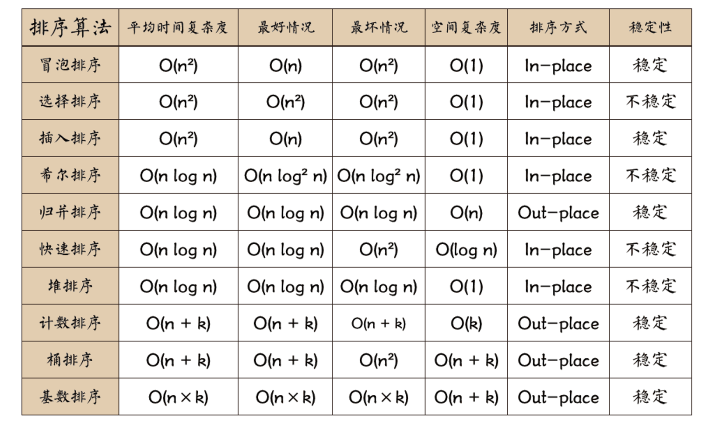

排序算法是《数据结构与算法》中最基本的算法之一。

排序算法可以分为 `内部排序` 和 `外部排序`，`内部排序` 是数据记录在内存中进行排序，`外部排序` 是因排序的数据很大，一次不能容纳全部的排序记录，在排序过程中需要访问外存。

常见的内部排序算法有:

* **冒泡排序：**比较任何两个相邻的项，如果第一个比第二个大，则交换它们；元素项向上移动至正确的顺序，好似气泡上升至表面一般，因此得名。

* **选择排序：**每一次从待排序的数据元素中选出最小（或最大）的一个元素，存放在序列的起始位置，以此循环，直至排序完毕。

* **插入排序：**将一个数据插入到已经排好序的有序数据中，从而得到一个新的、个数加一的有序数据，此算法适用于少量数据的排序，时间复杂度为 `O(n^2)`。

* **归并排序：**将原始序列切分成较小的序列，只到每个小序列无法再切分，然后执行合并，即将小序列归并成大的序列，合并过程进行比较排序，只到最后只有一个排序完毕的大序列，时间复杂度为 `O(n log n)`。

* **快速排序：**通过一趟排序将要排序的数据分割成独立的两部分，其中一部分的所有数据都比另外一部分的所有数据都要小，然后再按此方法对这两部分数据分别进行上述递归排序，以此达到整个数据变成有序序列，时间复杂度为 `O(n log n)`。

* **希尔排序：**先将整个待排序的记录序列分割成为若干子序列分别进行直接插入排序，待整个序列中的记录“基本有序”时，再对全体记录进行依次直接插入排序。

* **计数排序：**计数排序的核心在于将输入的数据值转化为键存储在额外开辟的数组空间中。作为一种线性时间复杂度的排序，计数排序要求输入的数据必须是有确定范围的整数。

* **桶排序：**桶排序是计数排序的升级版。它利用了函数的映射关系，高效与否的关键就在于这个映射函数的确定。

* **基数排序：**基数排序是一种非比较型整数排序算法，其原理是将整数按位数切割成不同的数字，然后按每个位数分别比较。由于整数也可以表达字符串（比如名字或日期）和特定格式的浮点数，所以基数排序也不是只能使用于整数。

用一张图概括：

从分类上：

<table>
  <tr>
    <td rowspan="5">排序算法</td>
    <td>**排序算法**</td>
    <td>冒泡排序</td>
    <td>冒泡排序</td>
  </tr>
  <tr>
    <td>**选择排序**</td>
    <td>选择排序</td>
    <td>堆排序</td>
  </tr>
  <tr>
    <td>**插入排序**</td>
    <td>插入排序</td>
    <td>希尔排序</td>
  </tr>
  <tr>
    <td>**归并排序**</td>
    <td>归并排序</td>
  </tr>
  <tr>
    <td>**分布排序**</td>
    <td>计数排序</td>
    <td>桶排序</td>
    <td>基数排序</td>
  </tr>
</table>

### 名词解释：

* `n`：数据规模
* `k`：“桶”的个数

##### 稳定性

* 稳定：如果在原序列中，`a = b`，且 `a` 在 `b` 之前，在排序后的序列中，`a` 仍在 `b` 的前面
* 不稳定：如果在原序列中，`a = b`，且 `a` 在 `b` 之前，在排序后的序列中，`a` 可能成出现在 `b` 的后面

> 稳定的排序算法：冒泡排序、插入排序、归并排序、计数排序、桶排序、基数排序

> 不是稳定的排序算法：选择排序、快速排序、希尔排序、堆排序

##### 排序方式

* 内排序：排序操作都在内存中完成，占用常数内存，不占用额外内存。适用于数据量小的
* 外排序：排序过程中要进行数据的内、外存交换，占用额外内存。适用于数据量大的

##### 复杂度

* 时间复杂度: 一个算法执行所耗费的时间
* 空间复杂度: 运行完一个程序所需内存的大小

