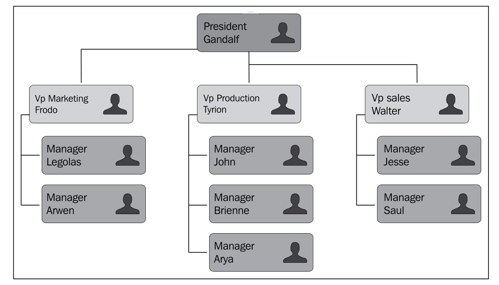
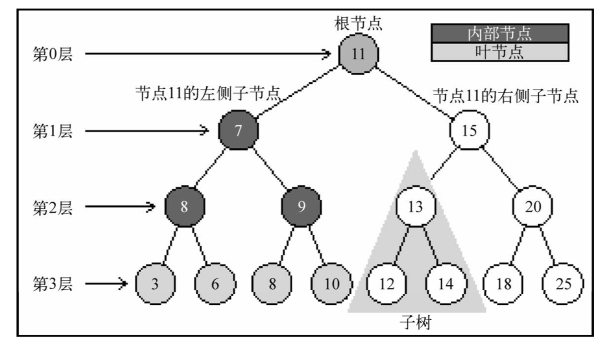
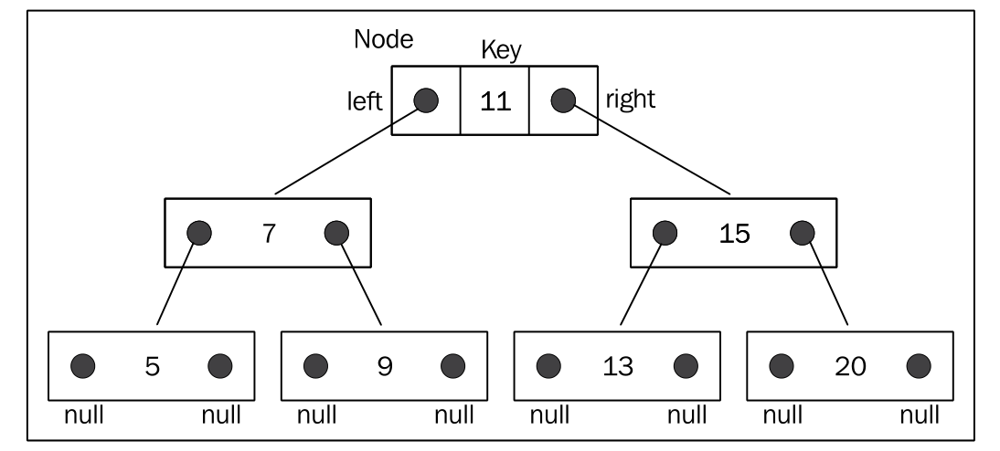
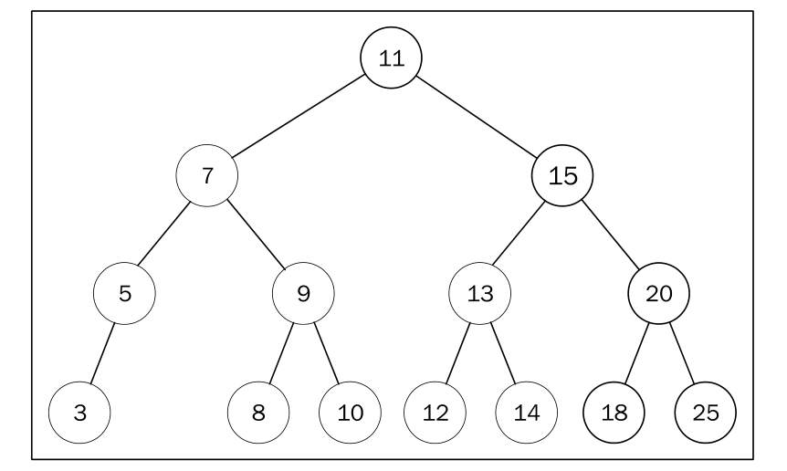

### 基本概念

> 树是一种非线性的数据结构，以分层的方式存储数据，它对于存储需要快速查找的数据非常有用。

现实生活中最常见的树的例子是家谱，或是公司的组织架构图，如下图：



一个树结构包含一系列存在父子关系的节点。每个节点都有一个父节点（除了顶部的第一个 节点）以及零个或多个子节点：



树大概包含以下几种结构/属性：

* 节点
  * 根节点
  * 内部节点：非根节点、且有子节点的节点
  * 外部节点/页节点：无子节点的节点
* 子树：就是大大小小节点组成的树
* 深度：节点到根节点的节点数量
* 高度：树的高度取决于所有节点深度中的最大值
* 层级：也可以按照节点级别来分层


### 二叉树和二叉搜索树

二叉树是一种特殊的树，它的子节点个数不超过两个。有助于高效的向/从树中插人、查找和删除节点。

二叉搜索树（BST）是二叉树的一种，相对较小的值保存在左节点中，较大的值保存在右节点中。上图中就展现了一棵二叉搜索树。

下图展现了二叉搜索树数据结构的组织方式：



实现一个 BinarySearchTree 类:

```js

// 定义一个 Node 类
class Node {
  constructor(key) {
    this.key = key;
    this.left = null;
    this.right = null;
  }
}

class BinarySearchTree {
  constructor() {
    this.root = null;
  }

  // 插入
  insert(key) {
    const newNode = new Node(key);
    const insertNode = (node, newNode) => {
      if (newNode.key < node.key) {
        if (node.left === null) {
          node.left = newNode;
        } else {
          insertNode(node.left, newNode);
        }
      } else {
        if (node.right === null) {
          node.right = newNode;
        } else {
          insertNode(node.right, newNode);
        }
      }
    }

    if (!this.root) {
      this.root = newNode;
    } else {
      insertNode(this.root, newNode);
    }
  }
}

const tree = new BinarySearchTree();
tree.insert(11)
tree.insert(7)
tree.insert(5)
tree.insert(3)
tree.insert(9)
tree.insert(8)
tree.insert(10)
tree.insert(13)
tree.insert(12)
tree.insert(14)
tree.insert(20)
tree.insert(18)
tree.insert(25)
```

最终构建的树如下图所示：



### 树的遍历

