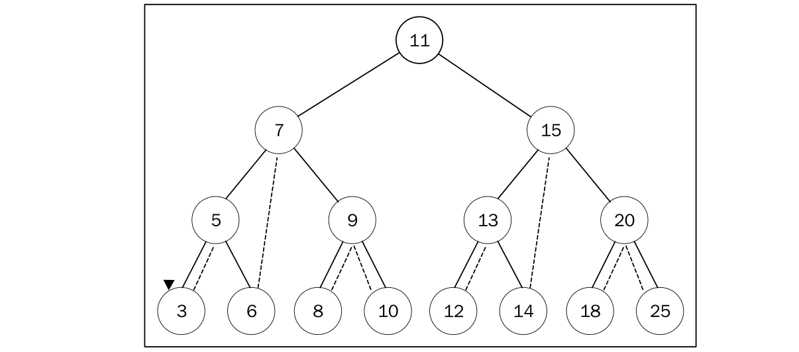
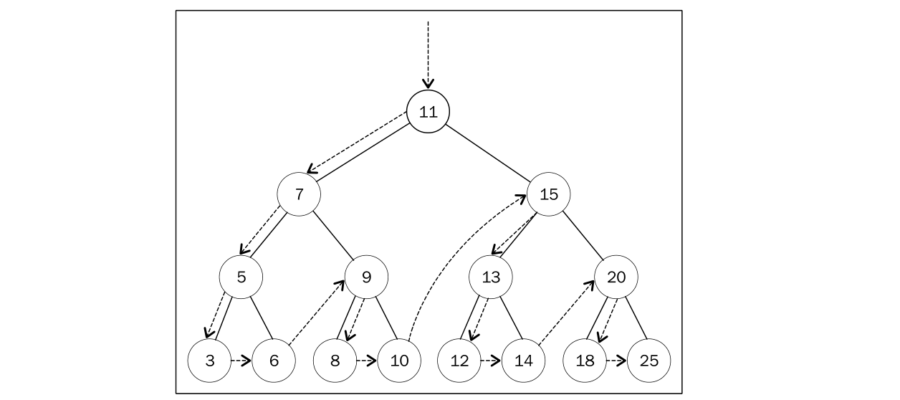
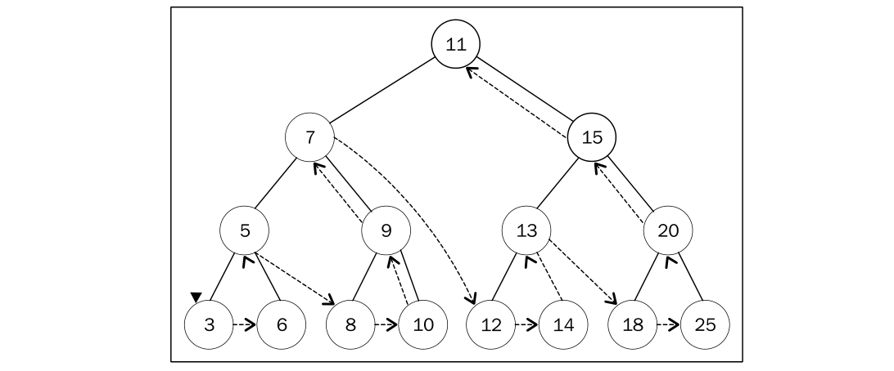

### 基本概念

> 树是一种非线性的数据结构，以分层的方式存储数据，它对于存储需要快速查找的数据非常有用。

现实生活中最常见的树的例子是家谱，或是公司的组织架构图，如下图：


一个树结构包含一系列存在父子关系的节点。每个节点都有一个父节点（除了顶部的第一个 节点）以及零个或多个子节点：


树大概包含以下几种结构/属性：

* 节点
  * 根节点
  * 内部节点：非根节点、且有子节点的节点
  * 外部节点/页节点：无子节点的节点
* 子树：就是大大小小节点组成的树
* 深度：节点到根节点的节点数量
* 高度：树的高度取决于所有节点深度中的最大值
* 层级：也可以按照节点级别来分层


### 二叉树和二叉搜索树

二叉树是一种特殊的树，它的子节点个数不超过两个。有助于高效的向/从树中插人、查找和删除节点。

二叉搜索树（BST）是二叉树的一种，相对较小的值保存在左节点中，较大的值保存在右节点中。上图中就展现了一棵二叉搜索树。

下图展现了二叉搜索树数据结构的组织方式：


实现一个 BinarySearchTree 类:

```js

// 定义一个 Node 类
class Node {
  constructor(key) {
    this.key = key;
    this.left = null;
    this.right = null;
  }
}

class BinarySearchTree {
  constructor() {
    this.root = null;
  }

  // 插入
  insert(key) {
    const newNode = new Node(key);
    const insertNode = (node, newNode) => {
      if (newNode.key < node.key) {
        if (node.left === null) {
          node.left = newNode;
        } else {
          insertNode(node.left, newNode);
        }
      } else {
        if (node.right === null) {
          node.right = newNode;
        } else {
          insertNode(node.right, newNode);
        }
      }
    }

    if (!this.root) {
      this.root = newNode;
    } else {
      insertNode(this.root, newNode);
    }
  }
}

const tree = new BinarySearchTree();
tree.insert(11)
tree.insert(7)
tree.insert(5)
tree.insert(3)
tree.insert(6)
tree.insert(9)
tree.insert(8)
tree.insert(10)
tree.insert(15)
tree.insert(13)
tree.insert(12)
tree.insert(14)
tree.insert(20)
tree.insert(18)
tree.insert(25)
```

最终构建的树如下图所示：


### 遍历二叉树

有三种遍历 `BST(二叉查找树)` 的方式:中序、先序和后序。

##### 中序遍历

> 中序遍历是一种以上行顺序访问 `BST` 所有节点的遍历方式，也就是以从最小到最大的顺序访 问所有节点。

中序遍历的一种应用就是对树进行排序操作。

我们来看它的实现：

```js
// 中序遍历
inOrderTraverse(callback) {
  const orderTraverseNode = (node, callback) => {
    if (node !== null) {
      orderTraverseNode(node.left, callback);
      callback(node.key);
      orderTraverseNode(node.right, callback);
    }
  }
  orderTraverseNode(this.root, callback);
}
```

`inOrderTraverse` 方法接收一个回调函数作为参数，回调函数用来定义我们对遍历到的每个节点进行的操作，这也叫作访问者模式。

在之前展示的树上执行下面的方法：

```js
tree.inOrderTraverse(value => {
  console.log(value);
})
```

下面的结果将会在控制台上输出（每个数字将会输出在不同的行）:

`3 5 6 7 8 9 10 11 12 13 14 15 18 20 25`

下面的图描绘了 `inOrderTraverse` 方法的访问路径：



##### 先序遍历

> 先序遍历是以优先于后代节点的顺序访问每个节点的。

先序遍历的一种应用是打印一个结构化的文档。

我们来看它的实现：

```js
  // 先序遍历
  preOrderTraverse(callback) {
    const preOrderTraverseNode = (node, callback) => {
      if (node !== null) {
        callback(node.key)
        preOrderTraverseNode(node.left, callback);
        preOrderTraverseNode(node.right, callback);
      }
    }
    preOrderTraverseNode(this.root, callback);
  }
```

在之前展示的树上执行下面的方法：

```js
tree.preOrderTraverse(value => {
  console.log(value);
})
```

下面的结果将会在控制台上输出（每个数字将会输出在不同的行）:

`11 7 5 3 6 9 8 10 15 13 12 14 20 18 25`


下面的图描绘了 `preOrderTraverse` 方法的访问路径：




##### 后续遍历

> 后序遍历则是先访问节点的后代节点，再访问节点本身。

后序遍历的一种应用是计算一个目录和它的子目录中所有文件所占空间的大小。

我们来看它的实现：

```js
  // 后续遍历
  postOrderTraverse(callback) {
    const postOrderTraverseNode = (node, callback) => {
      if (node !== null) {
        postOrderTraverseNode(node.left, callback);
        postOrderTraverseNode(node.right, callback);
        callback(node.key);
      }
    }
    postOrderTraverseNode(this.root, callback);
  }
```

在之前展示的树上执行下面的方法：

```js
tree.postOrderTraverse(value => {
  console.log(value);
})
```

下面的结果将会在控制台上输出（每个数字将会输出在不同的行）:

`3 6 5 8 10 9 7 12 14 13 18 25 20 15 11`


下面的图描绘了 `postOrderTraverse` 方法的访问路径：



##### 三种遍历访问顺序

* 先序遍历：节点本身 => 左侧子节点 => 右侧子节点
* 中序遍历：左侧子节点 => 节点本身 => 右侧子节点
* 后序遍历：左侧子节点 => 右侧子节点 => 节点本身


### 在二叉查找树上进行查找

对 `BST` 通常有下列三种类型的查找:

* 查找给定值
* 查找最小值
* 查找最大值

##### 查找最小值 && 最大值

对于下图，你能一眼找到最小值和最大值吗？


实现：

```js
  get min() {
    const minNode = node => {
      return node ? (node.left ? minNode(node.left): node) : null;
    }

    return minNode(this.root);
  }

  get max() {
    const maxNode = node => {
      return node ? (node.right ? maxNode(node.right) : node) : null;
    }

    return maxNode(this.root);
  }
```

搜索给定的值：

```js
  search(key) {
    const searchNode = (node, key) => {
      if (node === null) return null;
      if (node.key === key) return node;
      return searchNode(key < node.key ? node.left : node.right, key);
    }

    return searchNode(this.root, key);
  }
```

删除节点：

```js
  // 移除节点
  remove(key) {
    const removeNode = (node, key) => {
      if (node === null) return null;
      if (node.key > key) {
        node.left = removeNode(node.left, key);
        return node;
      }
      if (node.key < key) {
        node.right = removeNode(node.right, key);
        return node;
      }
      if (node.key === key) {
        if (node.left === null && node.right === null) {
          node = null;
          return node;
        }
        if (node.left === null) {
          node = node.right;
          return node;
        }
        if (node.right === null) {
          node = node.left;
          return node;
        }
        const tempNode = this.min(node.right);
        node.key = tempNode.key;
        node.right = removeNode(node.right, tempNode.key);
        return node;
      }
    }

    return removeNode(this.root, key);
  }
```


